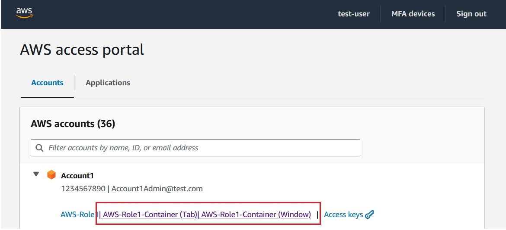
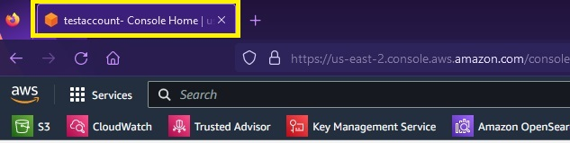
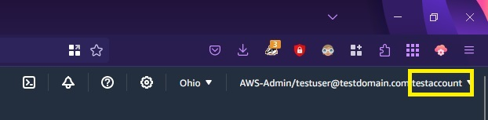
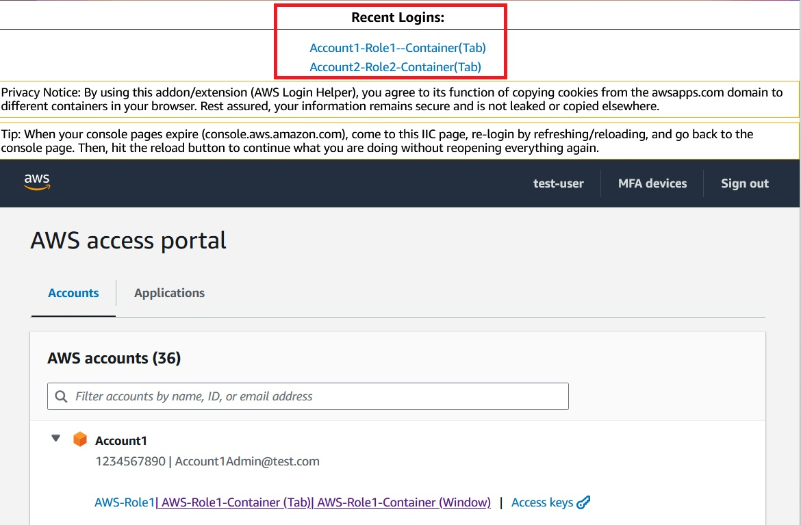
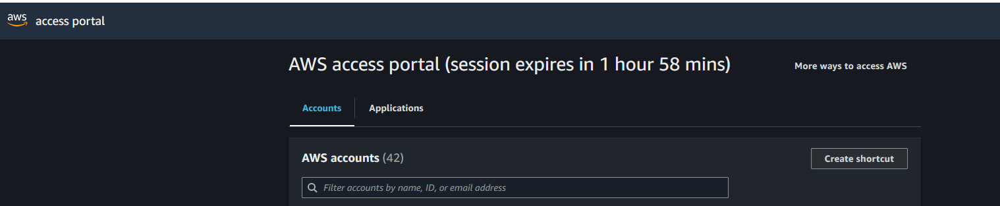
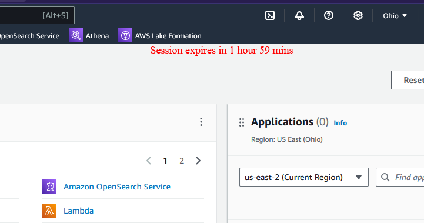

# AWS Login Helper

AWS Login Helper is a Firefox extension designed to enhance your login experience into AWS (Amazon Web Services).

Say goodbye to repetitive logins; simply log in once to the AWS IAM Identity Center (IIC), and then access the Management Console of any account for which you have permission to using Firefox containers in a new tab or window.

The extension offers several other features to streamline your AWS Console Experience:

# Privacy & Security

We take the privacy and security of our users very seriously. This extension does not store or leak any information. All the code is open source, and you can verify that.

# Inspiration

This project is inspired by [cookie-quick-manager](https://github.com/ysard/cookie-quick-manager/).

# Installation

You can install the AWS Login Helper extension from the official Firefox Add-ons website.

[Link to AWS Login Helper on Firefox Add-ons](https://addons.mozilla.org/en-US/firefox/addon/aws-login-helper/)

# Features

1. Authenticate Once, Sign into Multiple Accounts

    AWS Login Helper simplifies the login process by enabling you to authenticate once. After signing in using AWS IAM Identity Center (IIC), the extension enables you to log into different accounts using firefox containers without  repeatedly entering credentials. You can open the account you want to login in a new tab or a window **using the additional links added by the extension**.

    

2. Tab/Window Title Updates

    The extension updates the title of your Firefox tabs or windows to display the name of the currently active AWS account. This makes it easier to identify and manage your AWS sessions, especially when you have multiple AWS accounts open simultaneously.

    

3. Account Name Addition

    AWS Login Helper enhances the AWS Management Console by adding the account name to the role and user information displayed within the console. This feature simplifies navigation and ensures that you're always aware of the AWS account you're working in.

    

4. Recent Login History

    The Recent Login History feature in our Firefox extension for AWS login management showcases the five most recent role logins directly on the IIC login page. This saves users time and effort by eliminating the need to search for recent roles manually. 

     

5. Seamless Console Page Reload Post-Authentication

    Users need not tediously reopen console pages after session expiration. They can simply click the reload button in the AWS console, following re-authentication from the AWS IIC page, users stay on the same page, eliminating unnecessary steps and enhancing productivity. 

6. Session Expiry Time

    The extension displays the session expiry time in the Console and on the Login, Accounts, and Apps pages. This feature helps users keep track of their session status and plan their activities accordingly. 

   

   
      
# Supported AWS Services

AWS Login Helper is designed to work seamlessly with AWS IAM Identity Center (IIC) for a streamlined login experience. Please note that it does not currently support AWS Single Sign-On (SSO).

# Known Issues

You may lose the link to open an account/role in a new tab/window when you collapse and expand the account. We are actively working on a solution for this issue.

# Future Enhancements

We are continuously working to improve AWS Login Helper. Here are some enhancements that we have in our roadmap:

1. Grouping Accounts: We plan to add the ability to group accounts by user-configured terms for improved organization and easier account selection.

2. Color-Coding Containers: We will introduce the ability to color containers based on user-configured terms. This feature will provide a visual way to distinguish between accounts.

3. Tab/Window Title Toggle: We aim to add a toggle option to update the browser tab/window title. This will allow users to control whether they want the title updates.

4. Account Name Info Toggle: We plan to add a toggle to append the account name to the AWS Management Console role and user information. Users can choose to enable or disable this feature.

# Link to GitHub Repository
[Git-Repo](https://github.com/penchala-services-inc/aws-login-helper-firefox)

# Feedback and Contributions

We welcome your feedback and contributions to improve AWS Login Helper. If you encounter any issues, have ideas for enhancements, or want to contribute to the development, please visit our GitHub repository.

# License
[GPLv3](./LICENSE).

# Icons by
<a href="https://www.flaticon.com/free-icons/saas" title="saas icons">Saas icons created by Freepik - Flaticon</a>

